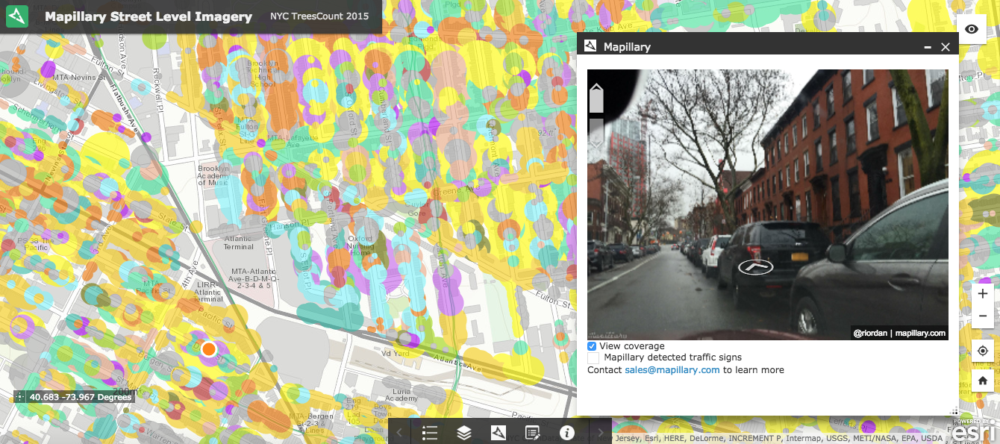

###NYC Treescount 2015 Mapillary Viewer

The Mapillary viewer is an easy way to observe, verify, and update geospatial datasets using street-level imagery. [Mapillary](http://www.mapillary.com) is a computer vision platform  which stitches together photos taken with any device (smartphones, action cameras, 360 cameras) into street level imagery for extracting geospatial data.  This new approach to Street View empowers governments and citizens to participate in collecting and visualizing geospatial data together.   

This example shows how the NYC Treescount 2015 dataset can be viewed using the Mapillary viewer embedded in an ArcGIS webmap (created using @geeknixta's Treescount 2015 layer).
By visualizing the dataset in photos, we can:
- give community stewardship volunteers better visual tools to engage with the data
- target and prioritize efforts to update the dataset where it looks outdated
- motivate more volunteers to capture their own photos to create fresh street level imagery to update the data

As a bonus, this can be part of an effort to create more comprehensive and current street level photo coverage of NYC. This community-based dataset **can be licensed** for other use by NYC Parks and other agencies. Over time, Mapillary's automated detection tools will recognize more objects within the imagery (trees, buildings, sidewalk conditions) to help with park operations.  

Try the ArcGIS example [here](http://webappbuilder.mapillary.io/webappbuilder/apps/9/).  The NYC Treescount 2015 dataset is quite large and takes some time to load up. Sorry! For instant gratification, screenshot and link to a video are below.   

Very short video: https://dl.dropboxusercontent.com/u/150338781/treescount.mp4

Note:  This example happens to use the existing Mapillary for ArcGIS widget; the Mapillary viewer is a simple JS library that can be integrated with any map platform (see more docs and examples [here](http://mapillary.github.io/mapillary-js/)).

